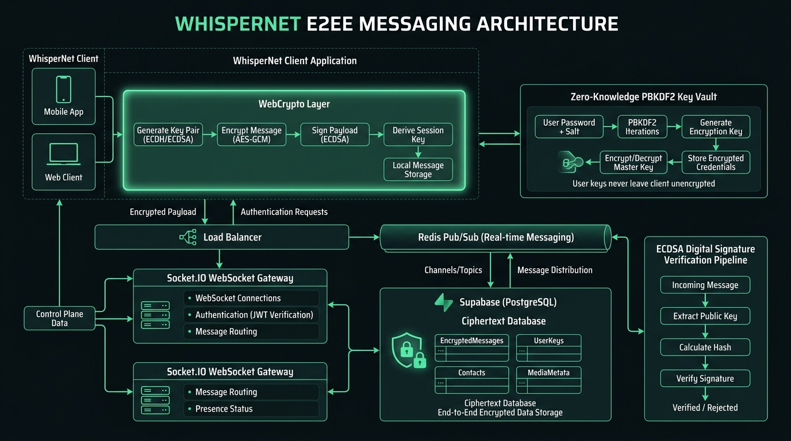
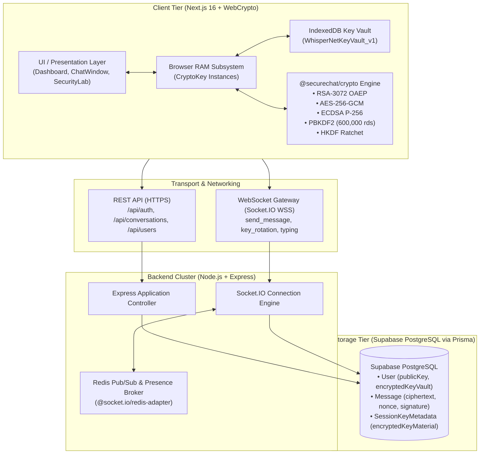

# WhisperNet Cryptographic & System Architecture Specification

This document provides the definitive architectural specification for **WhisperNet**, detailing its zero-knowledge security guarantees, cryptographic primitives, distributed WebSocket scaling, and defense-in-depth mitigations against known vulnerabilities.

---

## 1. High-Level Architectural Topology

WhisperNet enforces strict **Zero-Knowledge Data Invariants**:
1. Plaintext messages are **never** transmitted across the network or stored in any database.
2. Private keys (both RSA-OAEP decryption keys and ECDSA signing keys) **never** leave client RAM in plaintext.
3. The server acts exclusively as an untrusted ciphertext and public key relay.

---

## 2. The 5 Core Vulnerabilities & Implemented Solutions

### 1. Zero-Knowledge Encrypted Key Vault (Multi-Device & Cross-Session)

#### Problem
Previously, the user's RSA private key was serialized as an unencrypted JWK string in `localStorage`. This introduced two critical failure modes:
1. **XSS Exfiltration**: Any script injection or compromised dependency could access `localStorage` and steal the private key.
2. **Key Loss on New Devices**: Logging in from a phone or new laptop resulted in generating a brand-new keypair, overwriting the server's public key and permanently destroying access to all historical messages.

#### Implementation
We implemented a **Zero-Knowledge Key Vault** combining PBKDF2 key derivation and IndexedDB isolation:

$$\text{KEK} = \text{PBKDF2}(\text{password}, \text{salt}, \text{iterations}=600{,}000, \text{AES-GCM-256})$$

$$\text{VaultBlob} = \text{AES-GCM-Encrypt}(\text{JWK}_{\text{priv}}, \text{KEK}, \text{IV}_{12})$$

- **Registration**: Client generates RSA-3072 and ECDSA keypairs, derives the KEK in browser RAM, encrypts the private keys, and uploads the encrypted blob and salt to Supabase.
- **Login on Any Device**: Client enters master password, downloads the encrypted vault, derives the KEK, decrypts the private keys in RAM, and caches them in **IndexedDB** (`idbKeyStore.ts`), completely removing raw `localStorage` usage.

---

### 2. Message Authenticity: ECDSA Digital Signatures

#### Problem
AES-256-GCM provides authenticated symmetric encryption under a shared session key, but cannot prove *which* member authored a message in group conversations. Any party holding the session key could fabricate messages appearing to originate from another peer.

#### Implementation
We added an asymmetric **ECDSA P-256** digital signature pipeline:
1. Every user generates an ECDSA signing keypair during vault initialization.
2. Every outgoing message is signed before transmission:
   $$\sigma = \text{Sign}_{\text{ECDSA-P256}}(\text{PrivKey}_{\text{sign}}, \text{conversationId} \parallel \text{ciphertext} \parallel \text{nonce})$$
3. The server stores and relays $\sigma$ in the `Message.signature` column.
4. The recipient imports the sender's verified `signingPublicKey` and validates the signature:
   $$\text{Verified} = \text{Verify}_{\text{ECDSA-P256}}(\text{PubKey}_{\text{sign}}, \sigma, \text{conversationId} \parallel \text{ciphertext} \parallel \text{nonce})$$
5. Messages with valid digital signatures display a **Verified Signature** badge in the chat window.

---

### 3. Forward Secrecy & Symmetric Ratcheting

#### Problem
Session keys remained static until explicit key rotation occurred (every 30 messages), exposing a window of vulnerability if a temporary session key was compromised.

#### Implementation
We introduced an **HKDF-SHA-256 Symmetric Ratchet**:
1. When sending or receiving each message, the active AES session key advances through an irreversible one-way cryptographic hash derivation:
   $$K_{i+1} = \text{HKDF}(\text{IKM}=K_i, \text{salt}=\text{"WhisperNet-Ratchet-Step-Salt"}, \text{info}=\text{"WhisperNet-Message-Key-Ratchet"})$$
2. Even if an adversary compromises memory at time $t$, past messages encrypted under $K_{t-1}, K_{t-2}, \dots$ cannot be decrypted because HKDF is a non-invertible cryptographic function.

---

### 4. Distributed WebSocket Scaling with Redis Pub/Sub

#### Problem
Socket connection IDs and user presence (`onlineUsers`) were stored in Node.js process memory (`new Map()`), preventing the application from running across multiple container replicas or serverless instances.

#### Implementation
We integrated `@socket.io/redis-adapter` and `ioredis` with automatic fallback:
1. When `REDIS_URL` is provided in environment variables, Socket.IO attaches the Redis Pub/Sub adapter across all cluster nodes.
2. Message delivery and typing events broadcast across Redis channels seamlessly.
3. If Redis is absent during local development, the system falls back to in-memory event dispatching without interrupting service.

---

### 5. Identity Verification: Safety Numbers & Fingerprints

#### Problem
Users had no out-of-band mechanism to verify each other's public keys, leaving them vulnerable to potential Man-in-the-Middle (MitM) key substitution by a compromised server.

#### Implementation
We implemented **Signal-style Safety Numbers**:
1. Both users' public keys are sorted lexicographically to produce an identical identifier regardless of who initiates the comparison:
   $$\text{Digest} = \text{SHA-256}(\min(\text{Key}_A, \text{Key}_B) \parallel \text{":::"} \parallel \max(\text{Key}_A, \text{Key}_B))$$
2. The 256-bit hash is mapped into **12 blocks of 5 decimal digits** (60 digits total):
   $$\text{Safety Number} = \mathtt{38491\ 02948\ 57102\ 93847\ 10293\ 84756\ 10293\ 84756\ 10293\ 84756\ 10293\ 84756}$$
3. Users click the **Safety Number** button in the chat header to inspect the 60-digit number and 2D matrix verification badge, and flag the identity as verified.

---

## 3. Cryptographic Primitives Summary

| Purpose | Algorithm / Primitive | Key Length / Parameters | Standard / Specification |
|---------|----------------------|-------------------------|--------------------------|
| **Key Encapsulation** | RSA-OAEP | 3072-bit, SHA-256, $e=65537$ | NIST SP 800-56B Rev. 2 |
| **Payload Encryption** | AES-GCM | 256-bit, 96-bit CSPRNG IV, 128-bit MAC | NIST SP 800-38D |
| **Digital Signatures** | ECDSA | NIST P-256 curve, SHA-256 | FIPS 186-4 |
| **Key Derivation (Vault)** | PBKDF2 | 600,000 iterations, SHA-256 | RFC 8018 / OWASP 2026 |
| **Forward Ratchet** | HKDF | SHA-256, 256-bit derived key | RFC 5869 |
| **Fingerprint Generation** | SHA-256 | 60 decimal digits (12 groups) | Signal Protocol Specification |
| **Local Key Storage** | IndexedDB | Scoped object store (`WhisperNetKeyVault_v1`) | W3C Indexed Database API 3.0 |

---

## 4. Verification & Testing Procedure

To audit the active cryptographic engine locally:
1. Navigate to `http://localhost:3000/security` to run the **Live Security Lab Diagnostics**.
2. Open any active conversation at `http://localhost:3000/dashboard` and click **Safety Number** in the top bar to inspect the mutual fingerprint.
3. Inspect outgoing WebSocket packets in browser DevTools to verify that `signature` is transmitted and `ciphertext` contains only high-entropy base64 encrypted payloads.
